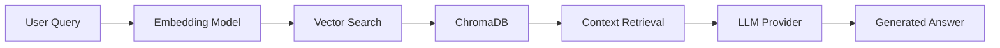

# RAG Document Assistant

An AI-powered Document Assistant that uses **Retrieval-Augmented Generation (RAG)** to perform semantic search and answer user questions from PDFs and text documents.


## ✨ Features

- 📄 **Document Upload**: Support for PDF, TXT, and Markdown files
- 🔍 **Semantic Search**: Find relevant content using vector embeddings
- 🤖 **AI-Powered Q&A**: Get accurate answers with source citations
- 💾 **Persistent Storage**: ChromaDB for reliable vector storage
- 🎨 **Modern UI**: Beautiful dark theme with chat interface
- 🔄 **Multiple LLM Providers**: Support for Ollama (local), Gemini API, and fine-tuned models
- ⚡ **Offline Mode**: Run completely offline with Ollama or fine-tuned models

## 🏗️ Architecture

```
User Question → Embedding → Vector Search → Context Retrieval → LLM → Answer
```



## 🚀 Quick Start

### Prerequisites

- Python 3.9+
- [Ollama](https://ollama.ai/) (for local LLM) **OR** Google API Key (for Gemini)

### Installation

```bash
# Clone the repository
git clone https://github.com/yourusername/rag-doc-assistant.git
cd rag-doc-assistant

# Create virtual environment
python -m venv venv
source venv/bin/activate  # On Windows: venv\Scripts\activate

# Install Python dependencies
pip install -r backend/requirements.txt
```

### Configuration

Copy the example environment file and configure:

```bash
cp .env.example backend/.env
```

Edit `backend/.env` with your settings:

```env
# LLM Provider: "finetuned" | "ollama" | "gemini"
LLM_PROVIDER=ollama

# Ollama Configuration (for local LLM)
OLLAMA_HOST=http://localhost:11434
OLLAMA_LLM_MODEL=llama3.2
OLLAMA_EMBED_MODEL=nomic-embed-text

# Gemini Configuration (for API-based LLM)
GOOGLE_API_KEY=your_api_key_here
EMBEDDING_MODEL=models/text-embedding-004
LLM_MODEL=gemini-2.0-flash

# Chunking Configuration
CHUNK_SIZE=512
CHUNK_OVERLAP=50
```

### Running the Application

**1. Start Ollama (if using local LLM):**

```bash
ollama serve
ollama pull llama3.2
ollama pull nomic-embed-text
```

**2. Start the backend server:**

```bash
cd backend
uvicorn main:app --reload --port 8000
```

**3. Open the frontend:**

Open `frontend/index.html` in your browser, or serve it:

```bash
cd frontend
python -m http.server 3000
```

Visit: http://localhost:3000

## 📚 API Endpoints

| Endpoint | Method | Description |
|----------|--------|-------------|
| `/` | GET | Health check |
| `/status` | GET | System status & document count |
| `/upload` | POST | Upload and index a document |
| `/query` | POST | Ask a question (RAG) |
| `/documents` | GET | List all indexed documents |
| `/documents/{id}` | DELETE | Remove a document |

## 📁 Project Structure

```
rag-doc-assistant/
├── backend/
│   ├── main.py              # FastAPI entry point
│   ├── config.py            # Configuration management
│   ├── document_processor.py # PDF/text extraction & chunking
│   ├── embeddings.py        # Embedding generation (Ollama/Gemini)
│   ├── vector_store.py      # ChromaDB operations
│   ├── rag_pipeline.py      # RAG orchestration & LLM providers
│   ├── trainer.py           # Fine-tuning utilities
│   └── requirements.txt     # Python dependencies
├── frontend/
│   ├── index.html           # Main UI
│   ├── styles.css           # Styling
│   └── app.js               # Frontend logic
├── uploads/                  # Uploaded documents (gitignored)
├── data/                     # ChromaDB storage (gitignored)
├── .env.example             # Environment template
└── README.md
```

## 💡 Usage

1. **Upload Documents**: Drag & drop or click to upload PDF/TXT/MD/docs files
2. **Select LLM Provider**: Choose between Ollama, Gemini, or fine-tuned model
3. **Ask Questions**: Type your question in the chat input
4. **Get Answers**: Receive AI-generated answers with source citations
5. **Manage Documents**: View and delete indexed documents in the sidebar

## 🛠️ Tech Stack

| Component | Technology |
|-----------|------------|
| **Backend** | Python, FastAPI, Uvicorn |
| **Vector DB** | ChromaDB |
| **Embeddings** | Ollama (nomic-embed-text) / Gemini |
| **LLM** | Ollama (llama3.2) / Gemini / Fine-tuned Flan-T5 |
| **PDF Parser** | PyMuPDF |
| **Frontend** | HTML, CSS, JavaScript |

## 🔧 LLM Providers

### Ollama (Recommended for Offline)
- Completely free and runs locally
- Requires [Ollama](https://ollama.ai/) installation
- Models: `llama3.2`, `nomic-embed-text`

### Gemini API
- Fast and powerful cloud-based LLM
- Requires Google API key
- Free tier available with quota limits

### Fine-tuned Model
- Custom model trained on your documents
- Best for domain-specific Q&A
- Run the trainer to generate your model


---

Built with ❤️ using RAG Architecture
